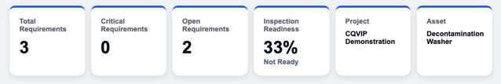
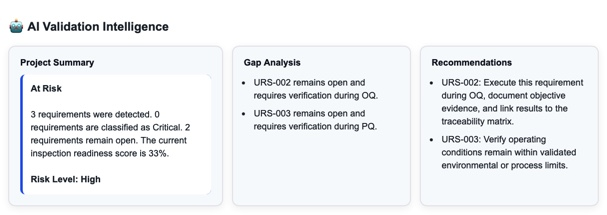
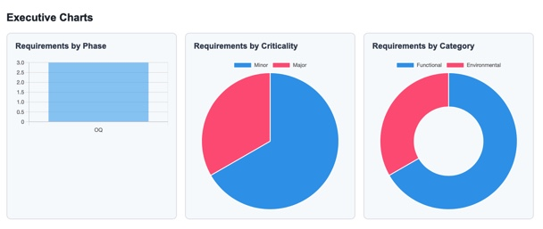
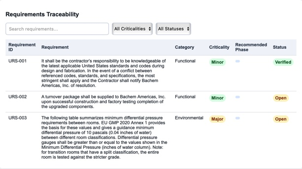
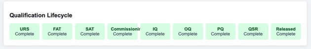

# CQVIP
### Commissioning, Qualification & Validation Intelligence Platform

CQVIP is an AI-powered validation platform built for the pharmaceutical and biotechnology industries. It automates document analysis, requirement extraction, traceability generation, inspection readiness assessment, and qualification package creation.

---

## Features

- AI Requirement Extraction
- Automated Traceability Matrix
- Executive Validation Dashboard
- Inspection Readiness Scoring
- AI Gap Analysis
- Validation Recommendations
- Qualification Lifecycle Tracking
- Interactive Charts
- Validation Package Generation

---

## Technology

- Python
- FastAPI
- HTML
- CSS
- JavaScript
- Chart.js

---
## Dashboard

## Dashboard

*Dashboard screenshots coming soon.*

---

## Vision

CQVIP is being developed to reduce validation effort, improve inspection readiness, and accelerate GMP project delivery through artificial intelligence.

---

## Status

🚧 Active Development

